# Batch Stream Pipeline

## Description

This repository was created as a learning resource for data processing using two main approaches: batch processing and streaming processing. The project simulates a modern data pipeline architecture, covering ingestion, processing, and storage, using open-source technologies commonly used in the big data industry. It also includes the process of building dimensional (dim) and fact tables, which are essential components in data warehousing and analytical processing.

Techstack I used for this project:

- **Airflow**: Orchestration engine for scheduling and running data ingestion, transformation, and creation of dimension and fact table jobs.
- **Druid**: OLAP Engine used for analytics.
- **Hive**: Metadata Layer for Data Warehouse.
- **Kafka**: Messaging Engine used for streaming data.
- **Kafka Pub-Sub**: Service that used for publish and consume message from Kafka.
- **Minio**: Object store tool used for Data Warehouse.
- **Postgresql**: Database, for storing generated source data
- **Spark**: Batch Processing Engine
- **Trino**: Distributed SQL Query Engine
- **Zookeeper**: Coordination service for managing distributed systems

That all of the services above are running on Docker containers.

## Overall data architecture

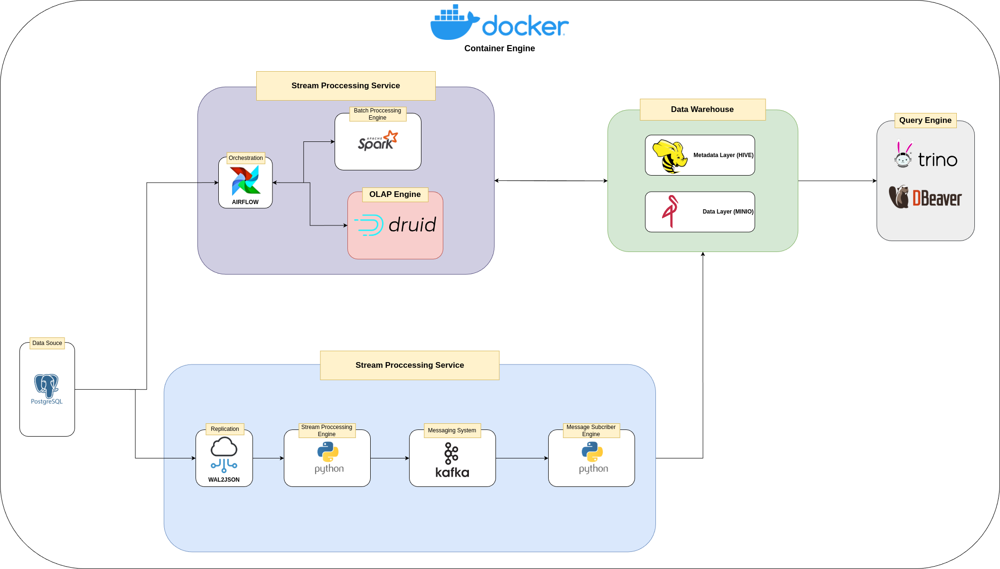

## Installation

This project runs entirely on Docker containers, so all you need to do is install [Docker Engine](https://docs.docker.com/engine/install/) (I also recommend using [Docker Desktop](https://docs.docker.com/desktop/) to make it easier to track logs from container services)

## Guide

You need to run the PostgreSQL container first because the `docker-compose.yml` file for PostgreSQL initializes the `dimfact-network` as a bridge network for the cluster.

You can run by command:

```shell
$ make database_up
```

Also you can run it at once by command:

```shell
$ make run_all
```


You can use the commands listed in the ```Makefile``` to run individual services sequentially, except for the ```run_all``` command.

The batch and streaming pipelines, along with the dimensional (dim) and fact tables, are automated using Python scripts and Docker containers.

**Note**: You might see warnings like the one below, but they can be ignored. This is because some images we build do not exist on the Docker repository.

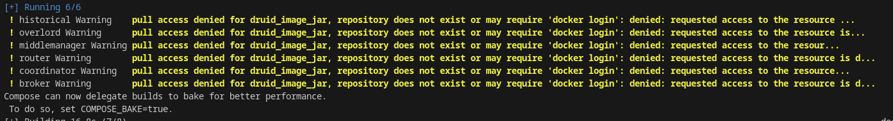

#### Access Services

##### Airflow

URL Access: http://localhost:8080/

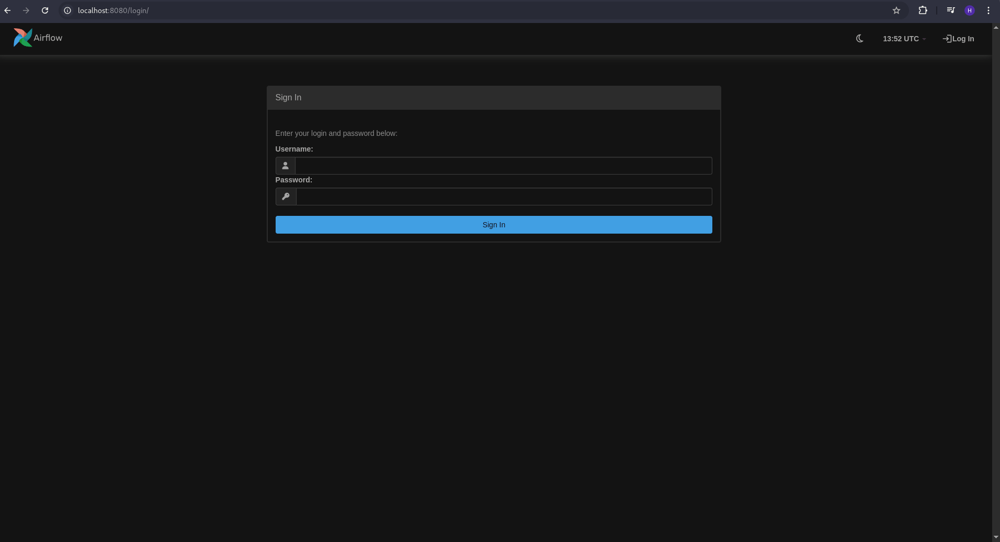
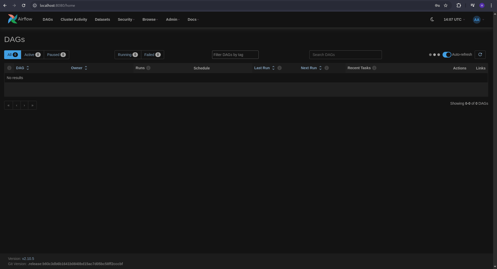

**Note**: You must see [Airflow README](development/airflow/README.md) for details guide

##### MinIO

URL Access: http://localhost:9001/

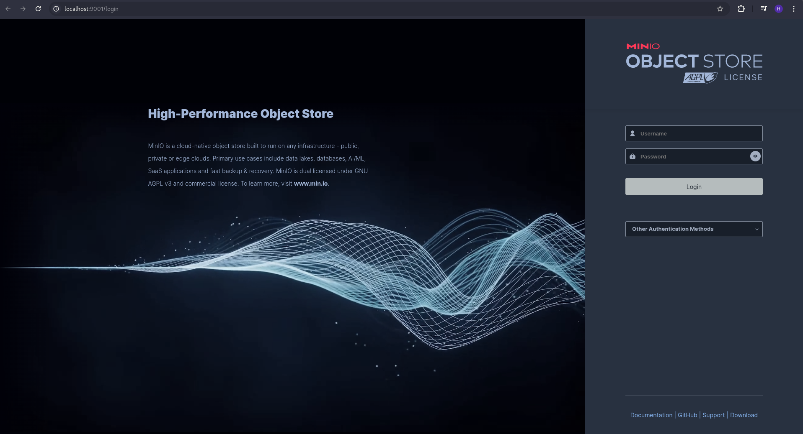
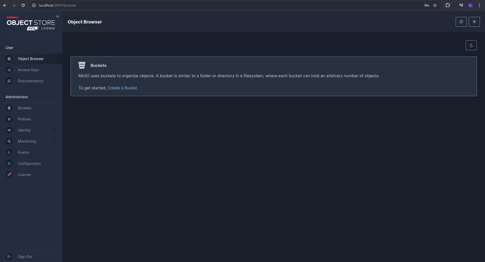

##### Spark

URL Access: http://localhost:9090/

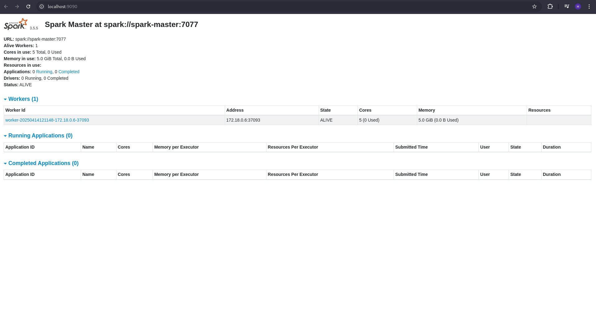

##### Druid

URL Access: http://localhost:28888/

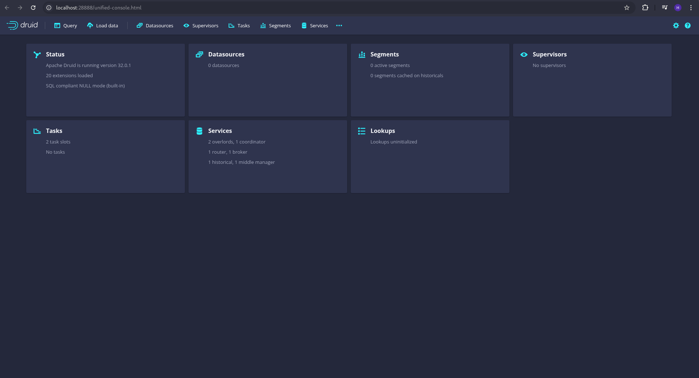

##### Kafka UI

URL Access: http://localhost:8088/

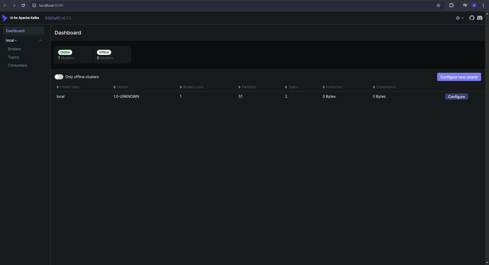

##### Trino UI

URL Access: https://localhost:28443/

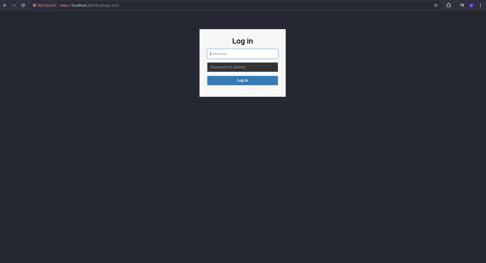
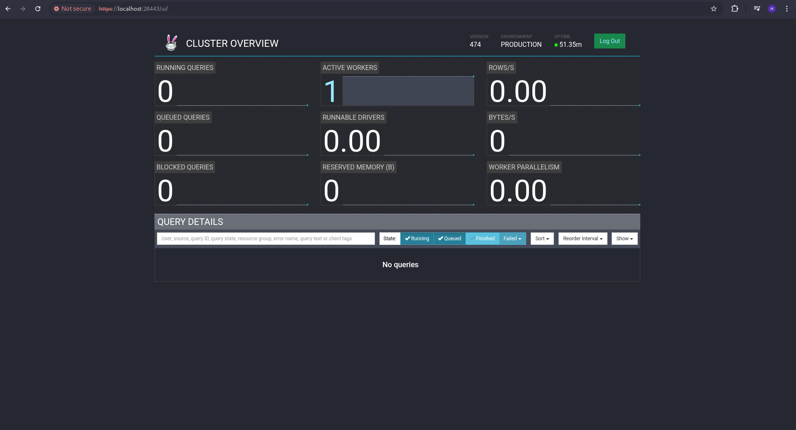

**Note**: You can see [Trino README](development/trino/README.md) for details guide

#### See Also

You can see below for details explanations:
- [Airflow](development/airflow/README.md)
- [Druid](development/druid/README.md)
- [Hive](development/hive/README.md)
- [Kafka](development/kafka/README.md)
- [Kafka Pubsubs](development/kafka_pubsubs/README.md)
- [MinIO](development/minio/README.md)
- [Postgresql](development/postgresql/README.md)
- [Spark](development/spark/README.md)
- [Trino](development/trino/README.md)