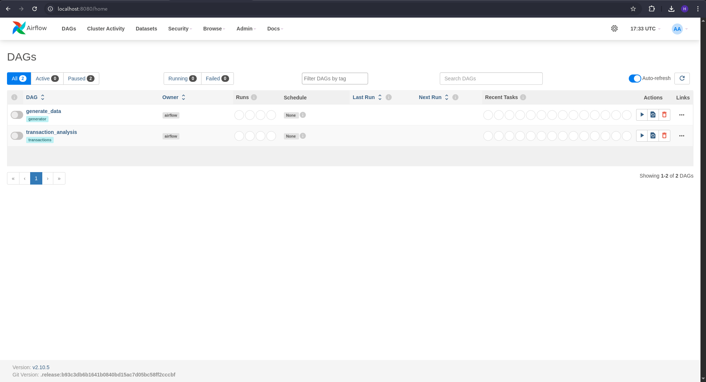

# Airflow

- Airflow is a service to manage and schedule data pipelines.
- In this repository, Airflow is used to run data pipelines (generate data sources, download data sources, ingest data into the warehouse, and publish to Druid).

### Deployment

You can use command:

```shell
$ docker compose -f development/airflow/docker-compose.yml up --build -d
```

wait until all container (except airflow-init) has running normally.

This container additionally installs the Java SDK (default version 17) and downloads the necessary JAR files from Maven. You can see the details in ```Dockerfile```.

### DAGs
```shell
dags/
├── configs/
│   ├── curated_job.json
│   ├── data_ingestion.json
│   ├── druid_publish.json
│   └── druid_schema.json
├── sql/
│   ├── dim_customers.sql
│   ├── dim_store_products.sql
│   └── fact_store_sales.sql
├── utils/
│   ├── druid_publishing.py
│   └── generator.py
├── generate_data.py
└── transactions.py
```

This data pipeline uses a ```Config Driven``` approach, meaning the pipeline's behavior and structure are determined by external configuration files rather than hardcoded logic. This means the DAGs Python script will create tasks, task groups, and function parameters based on the values set in the JSON config files located in the ```dags/configs``` folder, particularly for the script ```dags/transactions.py``` which handles data downloading, data ingestion, and Druid publishing.


### Guide

Access the Airflow UI at http://localhost:8080/ to run DAGs (login with username and password: ```admin```).


After logging in, you might see error notifications like this (click on the error notifications to expand them).


These errors occur because variables are not registered in Airflow. To resolve this, add the variables via the menu ```Admin > Variables```. There are two ways to do this: add them manually or upload a variable file in JSON format. In this repository, I have provided a variable JSON file [here](../../config/variables.json).


Then back to ```DAGs``` menu, dag ```transaction_analysis``` and ```generate_data``` will appear



First you need run ```generate_data``` dag to create data source


Check if the data has been generated into the data source (PostgreSQL), you can use a database tool like [DBeaver](https://dbeaver.io/download/).

If you have not created a connection, you can add one with the following configuration (use 'admin' as both the username and password).


You can check some table that has already created for sample


Then run ```transaction_analysis``` dag, wait until they successfully running


This DAG sequentially downloads data from the source, creates dimensional and fact tables, and publishes the data to Druid.

You can view the successfully processed data by visiting data warehouse (MinIO) at http://localhost:9001 and the Druid datasource at http://localhost:28888/unified-console.html#datasources.

**Note**: For detailed documentation and guides, see MinIO [here](../../development/minio/README.md) and Druid [here](../../development/druid/README.md).


### See Also

- See ```dags/README.md``` [here](dags/README.md) for details about DAG code and how the pipeline works based on the ```Config Driven``` approach  and how the pipeline processes data step-by-step.