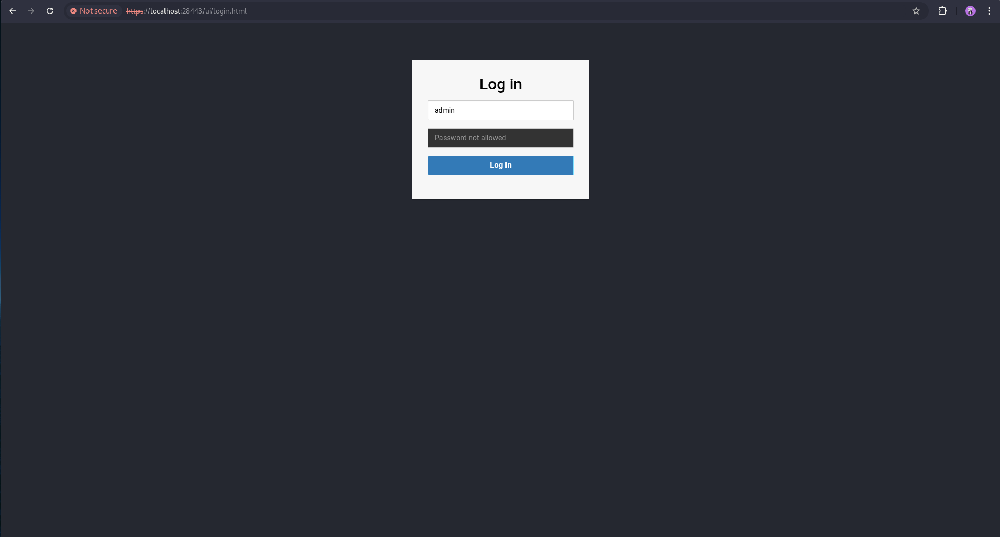
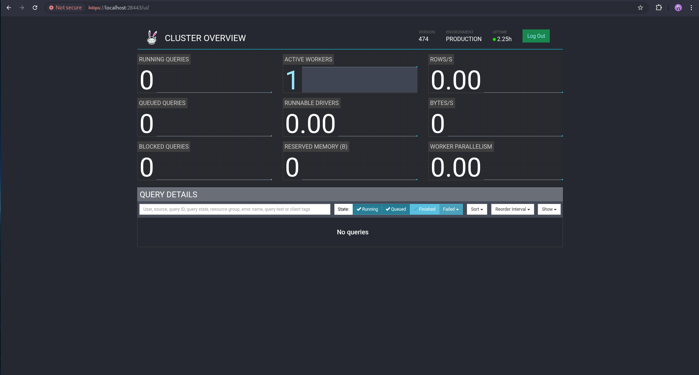
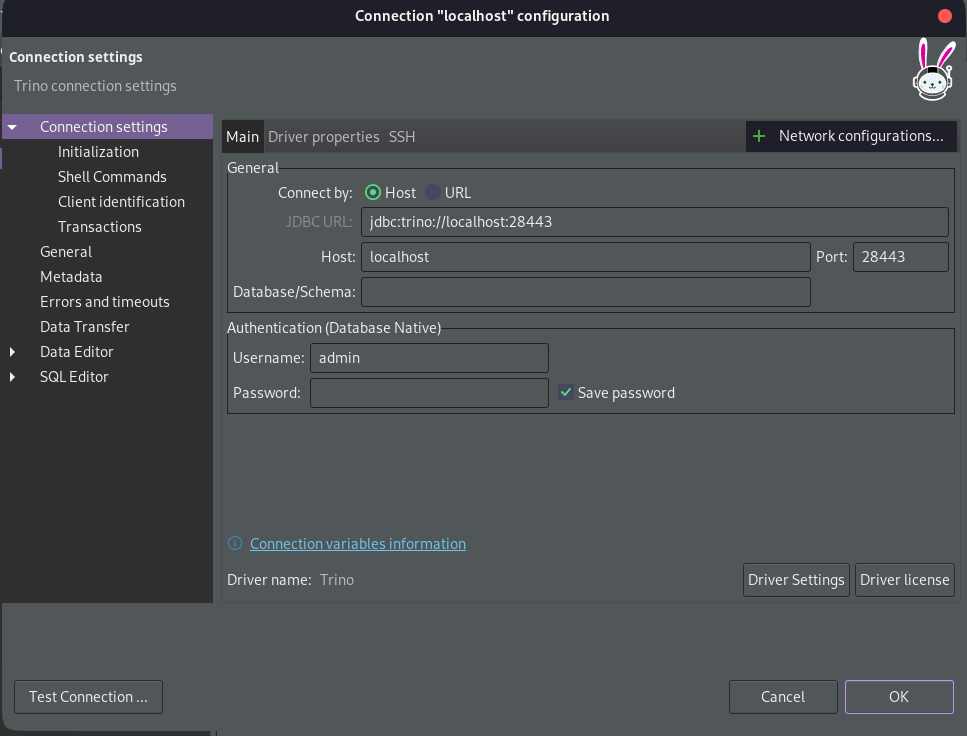
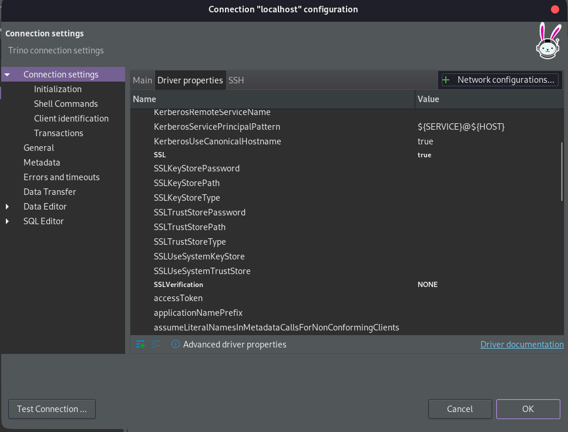
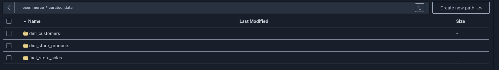
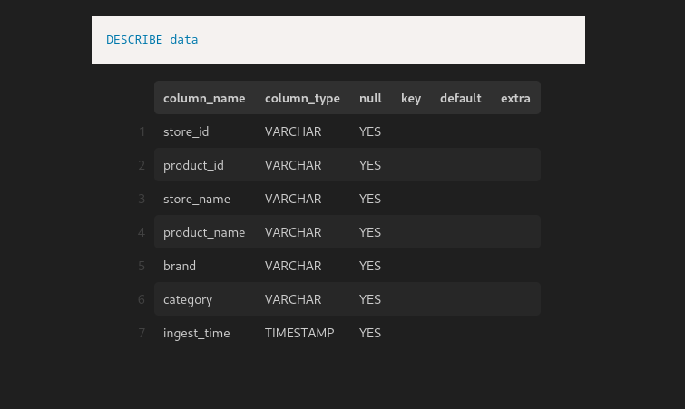
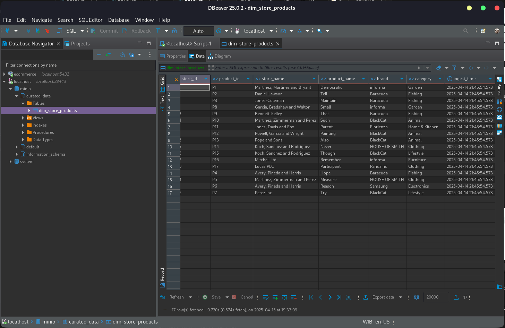

# Trino

- Trino is an open-source distributed SQL query engine designed to query large data sets distributed over one or more heterogeneous data sources.

- For details see [Trino documentation](https://trino.io/docs/current/overview.html)

## Guide

- You can monitor queries in the Trino UI by visiting https://localhost:28443/ui/ (login with username ```admin```)



After logging in, you will see a few status charts that you can use for monitoring SQL queries.



Next, we will create a schema and table using objects from the MinIO data warehouse. For this guide, we will use DBeaver as the database tool to run queries.

- First create connection to trino in DBeaver



**Note**: don't forget to change option _**SSL**_ to ```true``` and _**SSLVerification**_ to ```NONE``` in ```Driver properties``` tab.



- Then create schema from ```ecommerce/curated_data``` object with this query

```sql
create schema minio.curated_data 
with 
(
    location= 's3a://ecommerce/curated_data/'
);
```

- Create dimensions and fact tables based on the folders in the ```ecommerce/curated_data``` object



for example we will create table for ```dim_store_products``` with this query:

```sql
CREATE TABLE minio.curated_data.dim_store_products (
	store_id VARCHAR,
	product_id VARCHAR,
	store_name VARCHAR,
	product_name VARCHAR,
	brand VARCHAR,
	category VARCHAR,
	ingest_time TIMESTAMP
) WITH (
    external_location = 's3a://ecommerce/curated_data/dim_store_products/',
    format = 'PARQUET'
);
```

for column names and data types, you can get them by downloading the parquet file from the object folder and reading the parquet file to get information about the columns and data types. To read the Parquet file, you can use the VSCode extension [Parquet Explorer](https://marketplace.visualstudio.com/items?itemName=AdamViola.parquet-explorer). With this extension, you can read and run SQL queries to a file like this:



After running the CREATE TABLE query, you will be able to see the ```dim_store_products``` table in the ```curated_data``` schema.



Repeat this step for other folders in the `curated_data` object.